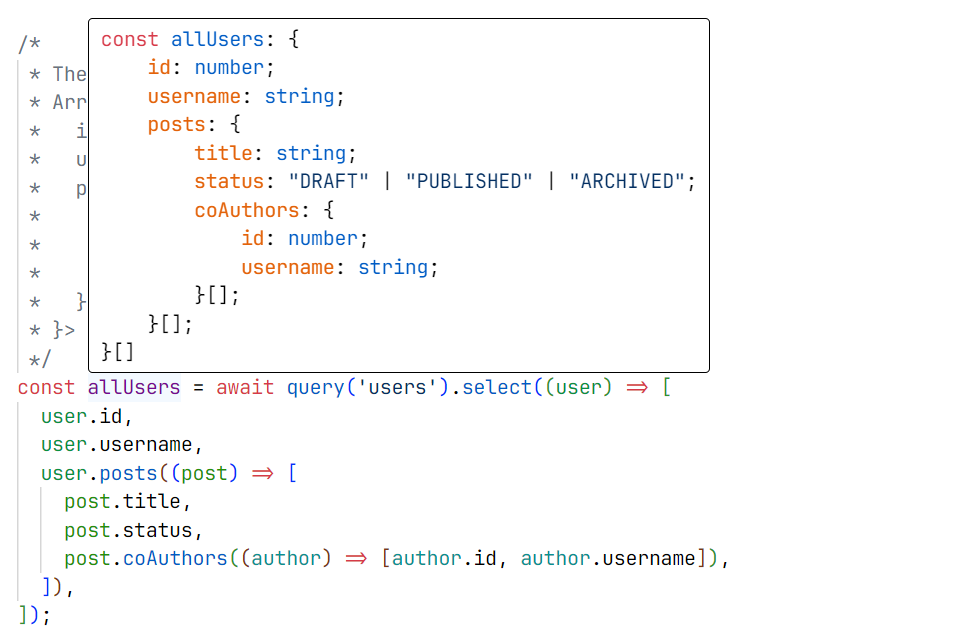
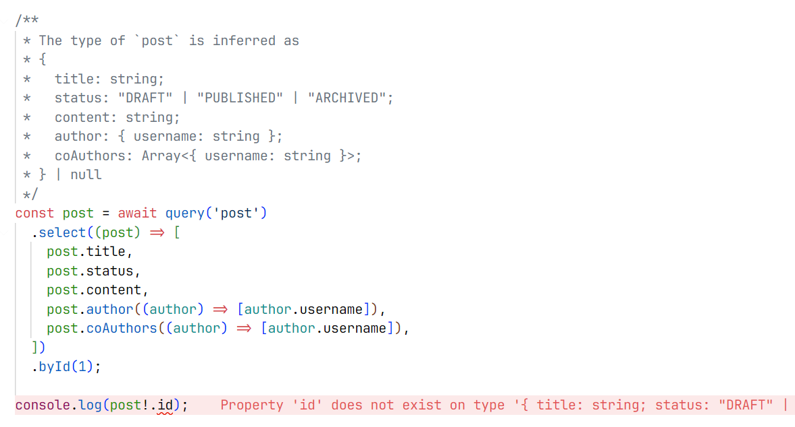

# graphql-intuitive-request

Intuitive and (more importantly) TS-friendly GraphQL client for queries, mutations and subscriptions

## Overview

graphql-intuitive-request provides an **intuitive** and **TS-friendly** way to write GraphQL queries, mutations and subscriptions(supports only graphql-ws) **without using string literals**, and provides **exact** return types inference.

### Example

```typescript
import { createClient, enumOf } from 'graphql-intuitive-request';

const { query } = createClient('https://example.com/graphql').withSchema({
  User: {
    id: 'Int!',
    username: 'String!',
    email: 'String',
    posts: '[Post!]!',
  },
  Post: {
    id: 'Int!',
    status: 'PostStatus!',
    title: 'String!',
    content: 'String!',
    author: 'User!',
    coAuthors: '[User!]!',
  },
  PostStatus: enumOf('DRAFT', 'PUBLISHED', 'ARCHIVED'),

  Query: {
    users: ['=>', '[User!]!'],
    post: [{ id: 'Int!' }, '=>', 'Post'],
  },
});

/*
 * The type of `allUsers` is inferred as
 * Array<{
 *   id: number;
 *   username: string;
 *   posts: Array<{
 *     title: string;
 *     status: "DRAFT" | "PUBLISHED" | "ARCHIVED";
 *     coAuthors: Array<{ id: number; username: string }>;
 *   }>;
 * }>
 */
const allUsers = await query('users').select((user) => [
  user.id,
  user.username,
  user.posts((post) => [
    post.title,
    post.status,
    post.coAuthors((author) => [author.id, author.username]),
  ]),
]);

/*
 * The type of `post` is inferred as
 * {
 *   title: string;
 *   status: "DRAFT" | "PUBLISHED" | "ARCHIVED";
 *   content: string;
 *   author: { username: string };
 *   coAuthors: Array<{ username: string }>;
 * } | null
 */
const post = await query('post')
  .select((post) => [
    post.title,
    post.status,
    post.content,
    post.author((author) => [author.username]),
    post.coAuthors((author) => [author.username]),
  ])
  .byId(1);
```

As you can see, the return type of the “users” query is inferred as

```typescript
Array<{
  id: number;
  username: string;
  posts: Array<{
    title: string;
    status: 'DRAFT' | 'PUBLISHED' | 'ARCHIVED';
    coAuthors: Array<{ id: number; username: string }>;
  }>;
}>;
```

which is **exactly** what we want, not just a generic object like `User[]`!



The syntax is almost the same as the one used in GraphQL:

- Types are defined in the `withSchema` function.
- Types are nullable by default, and you can use `!` to indicate that a type is non-nullable.
- Wrapping a type in `[]` indicates that the type is a list.
- You can use `enumOf` to define an enum type, and it will be inferred as a union type of string literals. Enum type declarations must be placed on the top level of the `withSchema` function—Just like in a GraphQL schema, enum types cannot be defined inside other types.
- Queries, mutations and subscriptions are defined specially in `Query`, `Mutation` and `Subscription` fields of the `withSchema` function. The value of each field should be either of the following:
  - `['=>', 'ReturnType']` if the operation does not accept any input.
  - `[{ /* ... */ }, '=>', 'ReturnType']` if the operation accepts an input. In this case, the first element is an object representing the input type of the operation, and the third element is the return type of the operation.
  - Especially, you can use `'void'` as the return type of a mutation if it does not return anything (e.g. A mutation that always returns `null` and you don't care about the return value).

You may notice that we actually define a circular reference between `User` and `Post` in the `withSchema` function. This is not a problem, because graphql-intuitive-request is smart enough to handle this case. However, when dealing with circular references, you should be careful to avoid infinite loops—graphql-intuitive-request supports selecting all fields of an object recursively (as will be shown later), and infinite loops may occur when selecting all fields of an object with circular references.

Thanks to the great magic of TypeScript's type system, you can be sure that the types you define are correct at compile time, and you will get an error if you define an invalid type. Such form of type definition is inspired by [ArkType](https://arktype.io/), a powerful TypeScript type parser and validator.

So now when you access fields that are not requested in the query, TypeScript will throw an error at compile time! You can be sure that you will not access a field that does not exist in the query at runtime.



Also, now you get **intellisense** for the fields of the query, and you can **easily** add new fields to the query by making full use of TypeScript's type system! There's no need to use ESLint plugins to validate your GraphQL queries!


### Features

- **Exact return types inference** for queries, mutations and subscriptions—if you query an entity with **specific** fields, then the return type will be an object with those fields, **not a generic object**.
- **Intuitive** API made full use of TypeScript's type system—**no need** to write GraphQL queries in **string**s and use ESLint plugins to validate them, everything just in TypeScript!
- Built on top of `graphql-request`, with support for `graphql-ws` **subscriptions**.

## Installation

```shell
npm install graphql-intuitive-request
```

**Note:** Requires TypeScript >=5.0

> [!TIP]
>
> Turn on `strictNullChecks` in your `tsconfig.json` to get the best experience. Otherwise, graphql-intuitive-request will not be able to infer some nullable fields correctly, and would just infer them as non-nullable ones.

## Usage

`graphql-intuitive-client` is very smart and flexible, along with full TypeScript support, so you can use it in many ways. The following examples are just some common use cases.

```typescript
const { query, mutation } = createClient('https://example.com/graphql').withSchema({
  /* ... */
  Query: {
    user: [{ id: 'Int!' }, '=>', 'User!'],
    users: ['=>', '[User!]!'],
    /* ... */
  },
  Mutation: {
    login: [{ input: 'LoginInput!' }, '=>', 'LoginOutput!'],
    logout: ['=>', 'Boolean!'],
    removeUser: [{ id: 'Int!' }, '=>', 'Boolean!'],
    /* ... */
  },
});

// The normal way to execute operations
const user = await query('user') // user :: { id: number; name: string; }
  .select((user) => [user.id, user.name])
  .by({ id: 1 });
// Abbreviated syntax when the count of non-optional input fields is 1
// Here, the only non-optional input field is `id`, so we can use `byId` instead of `by({ id: /* ... */ })`
// In other cases, it may be `byUsername`, `byInput`, `byOptions`, etc.
const user = await query('user') // user :: { id: number; name: string; }
  .select((user) => [user.id, user.name])
  .byId(1);
// You can omit `select` if you want to select all fields (it would also select nested ones recursively)
const user = await query('user').byId(1); // user :: User
// The same is to `users`, you can see that it accepts no input, so there's no `by` method
const users = await query('users').select((user) => [user.id, user.name]); // users :: Array<{ id: number; name: string; }>
// Similarly, you can omit `select` if you want to select all fields
const users = await query('users'); // users :: User[]
// What about queries or mutations that do not return an object? As you can see, now there's no `select` method
const isUserRemoved = await mutation('removeUser').byId(1); // isUserRemoved :: boolean
const isLoggedOut = await mutation('logout'); // isLoggedOutSuccess :: boolean

// Subscriptions are also supported, but only subscriptions using `graphql-ws` protocol are supported
const { mutation, subscription } = createClient('https://example.com/graphql')
  .withWebSocketClient({ url: 'ws://example.com/graphql' })
  .withSchema({
    /* ... */
    Subscription: {
      commentAdded: [{ postId: 'Int!' }, '=>', 'Comment!'],
    },
  });

const onCommentAddedSubscription = subscription('commentAdded')
  .select((comment) => [comment.id, comment.content])
  .byPostId(1);
const unsubscribe = onCommentAddedSubscription.subscribe((comment) => {
  console.log(comment.id, comment.content);
});
setTimeout(async () => {
  await mutation('addComment').by({ postId: 1, content: 'Hello world!' });
  unsubscribe();
}, 1000);
```

For more details, you can check [the relevant test file](./test/client.spec.ts).

### Support for subscriptions

graphql-intuitive-request also supports GraphQL subscriptions. You can use `client.subscription` to create a subscription. The usage is similar to `client.query` and `client.mutation`.

Note that only subscriptions using `graphql-ws` protocol are supported. Due to the deprecated nature of `subscriptions-transport-ws`, we do not plan to support it in the future.

In order to connect to a `graphql-ws` subscription, you need to first use `client.withWebSocketClient` to attach a `graphql-ws` client to the graphql-intuitive-request client.

```typescript
import { createClient } from 'graphql-intuitive-request';

const { mutation, subscription } = createClient('https://example.com/graphql', {
  headers: {
    Authorization: `Bearer <your_jwt_token>`,
  },
})
  .withWebSocketClient({
    url: 'ws://example.com/graphql',
    connectionParams: {
      headers: {
        Authorization: `Bearer <your_jwt_token>`,
      },
    },
  })
  .withSchema(/* ... */);
```

The parameters of `createClient().withWebSocketClient` are the same as the parameters of `createClient` function from `graphql-ws` package. You can refer to the [documentation of `graphql-ws`](https://the-guild.dev/graphql/ws/docs/interfaces/client.ClientOptions) for more details.

Then you can use `client.subscription` to create a subscription.

```typescript
const onCommentAddedSubscription = subscription('commentAdded')
  .select((comment) => [comment.id, comment.content])
  .byPostId(1);

const unsubscribe = onCommentAddedSubscription.subscribe((comment) => {
  console.log(comment.id, comment.content);
});

setTimeout(async () => {
  await mutation('addComment').by({ postId: 1, content: 'Hello world!' });
  unsubscribe();
}, 1000);
```

_Note that you do not need to use `await` when creating a subscription or subscribe to a subscription._

Then you can see the following output in the console after 1 second:

```text
1 Hello world!
```

The `subscribe` method accepts three parameters:

- subscriber: Necessary. The subscriber function. It will be called when a new value is emitted by the subscription. It accepts one parameter, which is the value emitted by the subscription.
- onError: Optional. The error handler. It will be called when an error is emitted by the subscription. It accepts one parameter, which is the error emitted by the subscription.
- onComplete: Optional. The completion handler. It will be called when the subscription is completed. It accepts no parameter.

### Infer TypeScript types from GraphQL schema

It is annoying to define a type in GraphQL schema and repeat the same type in TypeScript. graphql-intuitive-request provides a convenient way to infer TypeScript types from the GraphQL schema.

`schema` is a helper function to validate a GraphQL schema. It simply returns the schema itself and does nothing at runtime, but it is useful for TypeScript to ensure that the schema is valid.

```typescript
import { createClient, enumOf, infer, schema } from 'graphql-intuitive-request';

const $ = schema({
  User: {
    id: 'Int!',
    username: 'String!',
    email: 'String',
  },
  Post: {
    id: 'Int!',
    status: 'PostStatus!',
    title: 'String!',
    content: 'String!',
    author: 'User!',
  },
  PostStatus: enumOf('DRAFT', 'PUBLISHED', 'ARCHIVED'),

  Query: {
    users: ['=>', '[User!]!'],
    post: [{ id: 'Int!' }, '=>', 'Post'],
  },
});

export const client = createClient('https://example.com/graphql').withSchema($);
```

After that, you can use the `infer` helper function to infer TypeScript types from the schema.

```typescript
const $$ = infer($);

/*
 * The type of `Post` is inferred as
 * Array<{
 *   id: number;
 *   status: "DRAFT" | "PUBLISHED" | "ARCHIVED";
 *   title: string;
 *   content: string;
 *   author: { id: number; username: string; email: string | null };
 * }>
 */
export type Post = typeof $$.Post;
```

As you can see, you can use `typeof inferred.<Type>` to get the inferred TypeScript type of a type in the schema. Like `schema`, `infer` also does nothing at runtime, it is only used to infer TypeScript types from the schema.

### Create object selector to eliminate duplication

It is annoying to repeat the same object selector every time when you want to select some fields of an object. graphql-intuitive-request provides a convenient way to eliminate the duplication of object selector.

For example, similar code like this may often be found in a project:

```typescript
const users = await query('users').select((user) => [
  user.id,
  user.name,
  user.roles((role) => [
    role.name,
    role.description,
    role.permissions((permission) => [permission.name]),
  ]),
]);

const currentUser = await query('currentUser').select((user) => [
  user.id,
  user.name,
  user.roles((role) => [
    role.name,
    role.description,
    role.permissions((permission) => [permission.name]),
  ]),
]);
```

Apparently, you don't want to repeat selecting the same fields of `Role` and `Permission` every time. You can easily eliminate the duplication of object selector like this:

```typescript
import { selectorBuilder } from 'graphql-intuitive-request';

const coreRoleFields = selectorBuilder<Role>().select((role) => [
  role.name,
  role.description,
  role.permissions((permission) => [permission.name]),
]);

const users = await query('users').select((user) => [
  user.id,
  user.name,
  user.roles(coreRoleFields),
]);

const currentUser = await query('currentUser').select((user) => [
  user.id,
  user.name,
  user.roles(coreRoleFields),
]);
```

The type returned by `selectorBuilder` has some helper methods like `.infer` or `.inferAsList` to help you infer the TypeScript type of the selector. These methods do not actually exist at runtime, they are only used to help TypeScript infer the type of the selector.

```typescript
/*
 * The type of `CoreRole` is inferred as
 * {
 *   name: string;
 *   description: string | null;
 *   permissions: Array<{ name: string }>;
 * }
 */
type CoreRole = typeof coreRoleFields.infer;

/*
 * The type of `CoreRoleList` is inferred as
 * Array<{
 *   name: string;
 *   description: string | null;
 *   permissions: Array<{ name: string }>;
 * }>
 */
type CoreRoleList = typeof coreRoleFields.inferAsList;
```

### Get query string

It is possible to get the query string of a query or mutation using similar syntax as the one used to create a query or mutation.

```typescript
import {
  queryString,
  mutationString,
  /* ... */
} from 'graphql-intuitive-request';

const queryUserString = queryString('user')
  .input({ id: 'ID!' })
  .select<User>((user) => [user.id, user.name])
  .build();
```

It is quite similar to the syntax used to create a query or mutation, but you should use `queryString` / `mutationString` / `subscriptionString` instead of `query` / `mutation` / `subscription`.

Also, we pass a generic parameter to the `select` method to indicate the return type of the query, mutation or subscription.

### Convert promise to query string and query request body

It is also possible to convert a client's queries, mutations and subscriptions to query strings and query request bodies.

For example, you can convert a query to query string like this:

```typescript
const queryString = query('users')
  .select((user) => [user.id, user.name])
  .toQueryString();
```

The query string will be like this:

```graphql
query users {
  users {
    id
    name
  }
}
```

You can also convert a query to request body like this:

```typescript
const queryRequestBody = query('user')
  .select((user) => [user.id, user.name])
  .byId(1)
  .toRequestBody();
```

The request body will be an object like this:

```javascript
{
  query: 'query user($id: Int!) {\n  user(id: $id) {\n    id\n    name\n  }\n}',
  variables: { id: 1 },
}
```

You should remember that we provide this functionality just for debugging purpose, so you should not use it in production. If you only want to get the query string, you should use `queryString`, `mutationString` or `subscriptionString` instead.

### Work with graphql-request

graphql-intuitive-request is built on top of graphql-request, so you can use all the features of graphql-request with graphql-intuitive-request.

You can get the underlying `GraphQLClient` instance of graphql-request by calling the `getRequestClient()` method on the client instance.

```typescript
const client = createClient('http://example.com/graphql').withSchema({
  /* ... */
});
const graphQLClient = client.getRequestClient();
```

You can pass the configuration object of `graphql-request` as the 2nd parameter of the `createClient` function. For example, say you’re using JWT for authentication, you can pass the JWT token in the `headers` option.

```typescript
const client = createClient('http://example.com/graphql', {
  headers: {
    Authorization: 'Bearer <your_jwt_token>',
  },
}).withSchema({
  /* ... */
});
```

### Handle errors

It is worth noting graphql-intuitive-request still use the same error handling mechanism as graphql-request. You can handle errors by catching them. The type of the error is `ClientError` from `graphql-request`, and graphql-intuitive-request also re-exports it.

```typescript
import { ClientError } from 'graphql-intuitive-request';
import { query } from './client';

try {
  const user = await query('user')
    .select((user) => [user.id, user.name])
    .byId(1);
  console.log(user);
} catch (error) {
  if (error instanceof ClientError) console.error(error.response.errors);
  else console.error(error);
}

// ... or use `Promise.catch`
void query('user')
  .select((user) => [user.id, user.name])
  .byId(1)
  .catch((err: ClientError) => {
    console.error(err.response.errors);
  });
```

### Work with graphql-ws

The subscription feature of graphql-intuitive-request is built on top of graphql-ws, so you can use all the features of graphql-ws with graphql-intuitive-request.

You can get the client provided by graphql-ws by calling the `getWSClient()` method on the client instance.

```typescript
const client = createClient('http://example.com/graphql')
  .withWebSocketClient({
    url: 'ws://example.com/graphql',
  })
  .withSchema({
    /* ... */
  });
const wsClient = client.getWSClient();
```

## Future Plans

Check [docs/future-plans.md](./docs/future-plans.md) for the future plans of graphql-intuitive-request.
